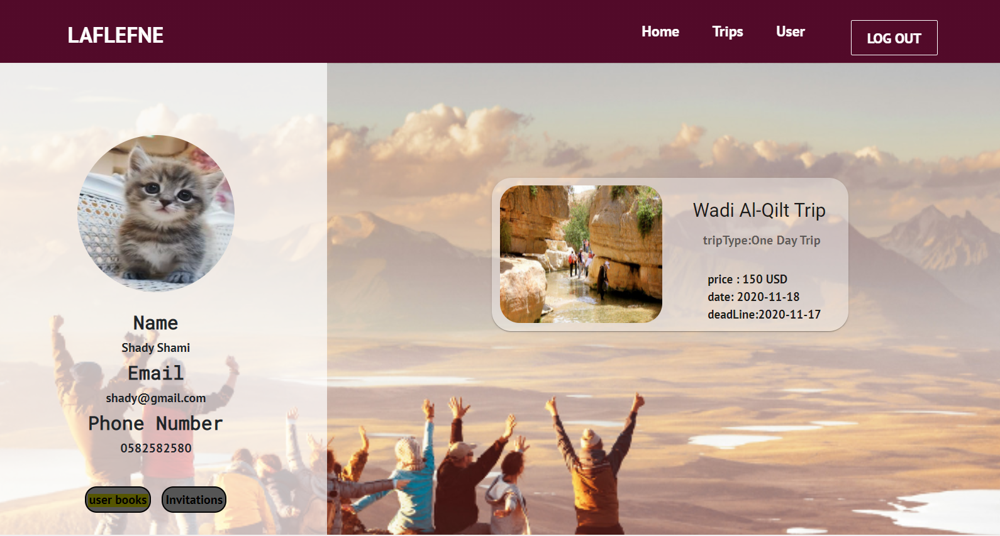
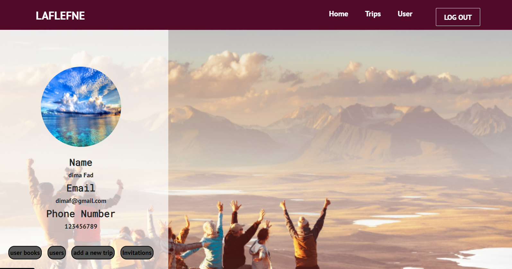
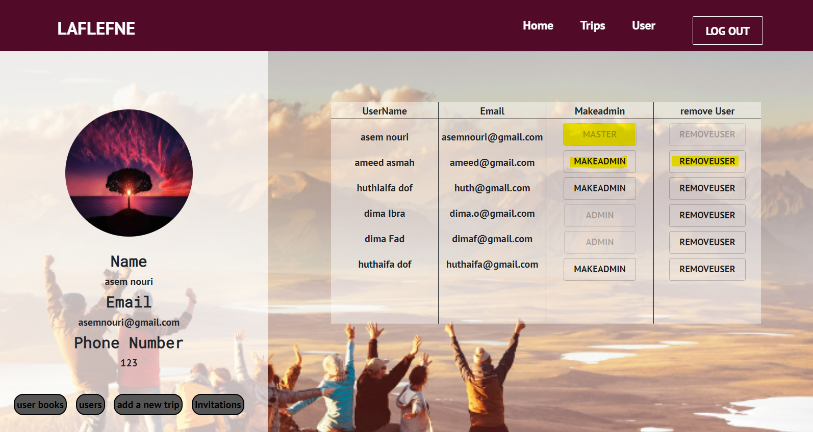
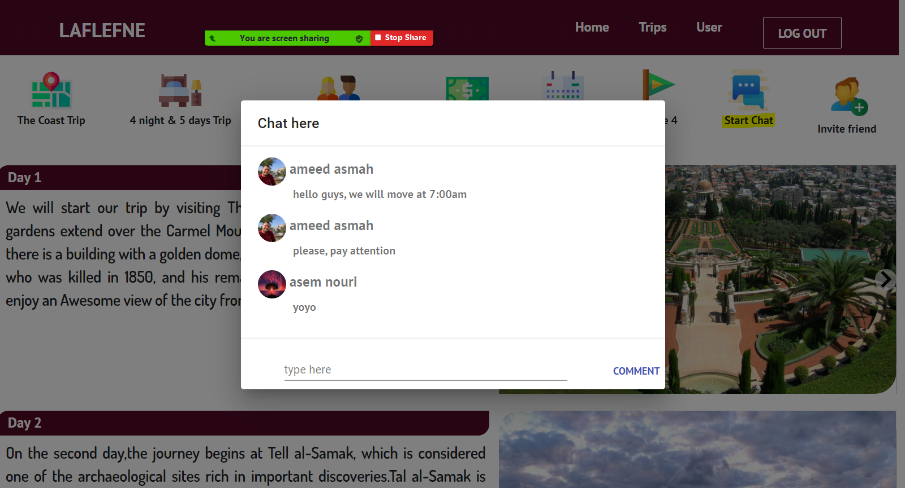
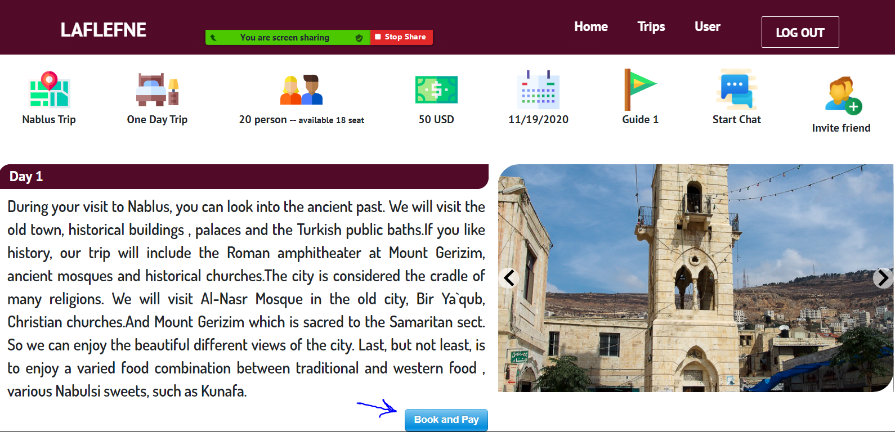
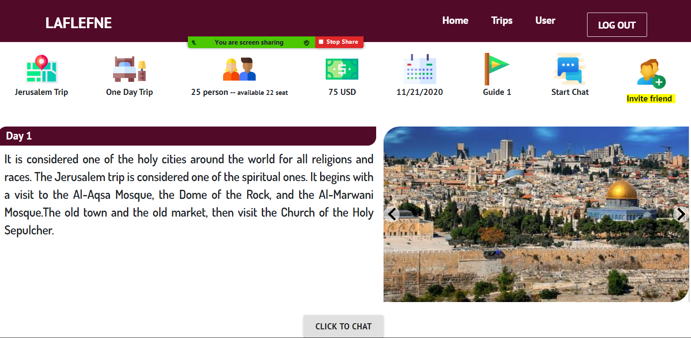

# Project Name : LafLefne 

## Legacy Team
  - Asem Nouri
  - Meena Fogha
  - Huthaifa dof
  - Ameed Asmah
  - Dima Jabr

## Table of Contents

1. [About](#about)
1. [Requirements](#requirements)
1. [Development](#development)
    1. [Installing Dependencies](#installing-dependencies)
1. [Picture Documentation](#documentation)
1. [Features](#features)
## About
Laflefne is local(Palestine) tour booking and viewing website.

## Requirements

- Node v12.18.4
- React v17.0.1

## Development

1. Fork the repo from github.
2. Clone down your fork
```
git clone https://github.com/<user Name>/GreenField5
```
3. Move into the repo after its been cloned onto your machine.
4. Follow the instructions in the 'Installing Dependencies' section.

### Installing Dependencies

1. Open terminal 1: From root directory to forntend directory:
```
cd frontend/
```
```
npm install
```
```
npm start
```
2. Open terminal 2: From within the root directory:
```
npm install
```
```
npm start 
```
open your localhost:4000

## Picture Documentation


## Features
-The new added features

```
User Profile
```

 ### normal-user-profile & functions:

 * View Invitations

 * View Booked Trips


 ### Admin-profile & functions:
 
 * Add new trip

 * Make-Admin - Remove-User


 ### Master-user-profile
 * All-Functions + Remove Admin Users


Common Functionalities: 

View Invitations

View Booked Trips


```
Trip Page
```
 ### Chat Box 
 

 ```
Buy Trip
```


 ```
Invite Friend
```
